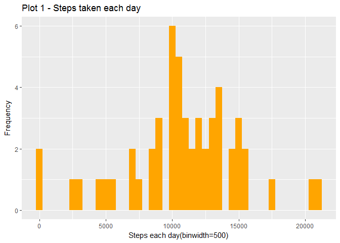
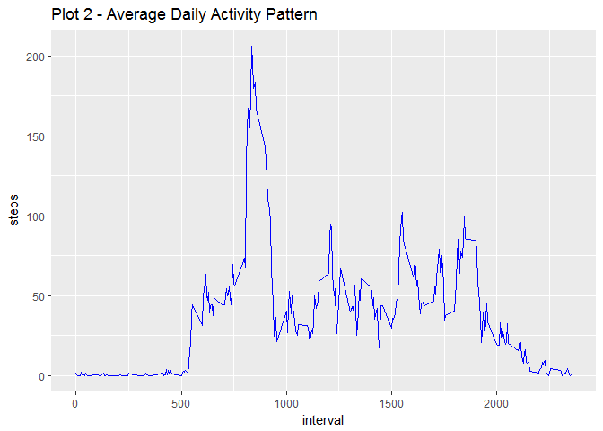
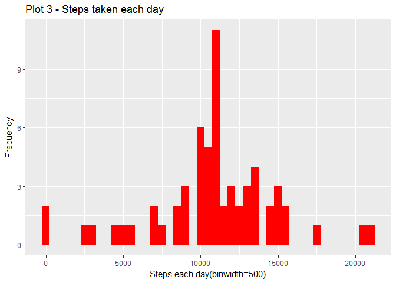
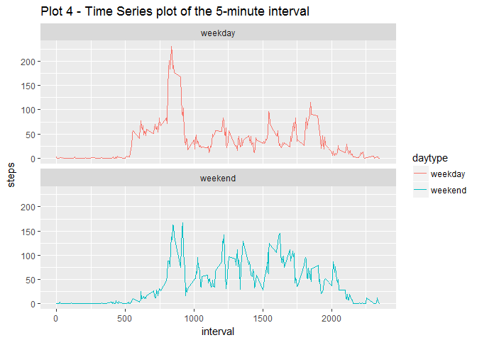

# Reproducible Research: Peer Assessment 1


---
output:
  html_document: default
  pdf_document: default


#Peer-graded Assignment: Course Project 1

##Instructions

###Introduction  
It is now possible to collect a large amount of data about personal movement using activity monitoring devices such as a Fitbit, Nike Fuelband, or Jawbone Up. These type of devices are part of the “quantified self” movement – a group of enthusiasts who take measurements about themselves regularly to improve their health, to find patterns in their behavior, or because they are tech geeks. But these data remain under-utilized both because the raw data are hard to obtain and there is a lack of statistical methods and software for processing and interpreting the data.
This assignment makes use of data from a personal activity monitoring device. This device collects data at 5 minute intervals through out the day. The data consists of two months of data from an anonymous individual collected during the months of October and November, 2012 and include the number of steps taken in 5 minute intervals each day.

        The data for this assignment 
        Dataset: Activity monitoring data [52K]

The variables included in this dataset are:
steps:          Number of steps taking in a 5-minute interval (missing values are NA)
date:           The date on which the measurement was taken in YYYY-MM-DD format
interval:       Identifier for the 5-minute interval in which measurement was taken

The dataset is stored in a comma-separated-value (CSV) file and there are a total of 17,568 observations in this dataset.


#                    Loading and preprocessing the data


###First step is to read data from working directory and look at summary


```r
        library(dplyr)
```

```
## Warning: package 'dplyr' was built under R version 3.3.3
```

```
## 
## Attaching package: 'dplyr'
```

```
## The following objects are masked from 'package:stats':
## 
##     filter, lag
```

```
## The following objects are masked from 'package:base':
## 
##     intersect, setdiff, setequal, union
```

```r
        library(ggplot2)
```

```
## Warning: package 'ggplot2' was built under R version 3.3.3
```

```r
        c1<-read.csv("activity.csv", stringsAsFactors = FALSE)
        c1$steps<-as.numeric(c1$steps)
        d1<-tbl_df(c1)
        summary(d1)
```

```
##      steps            date              interval     
##  Min.   :  0.00   Length:17568       Min.   :   0.0  
##  1st Qu.:  0.00   Class :character   1st Qu.: 588.8  
##  Median :  0.00   Mode  :character   Median :1177.5  
##  Mean   : 37.38                      Mean   :1177.5  
##  3rd Qu.: 12.00                      3rd Qu.:1766.2  
##  Max.   :806.00                      Max.   :2355.0  
##  NA's   :2304
```

```r
        d1
```

```
## # A tibble: 17,568 × 3
##    steps       date interval
##    <dbl>      <chr>    <int>
## 1     NA 2012-10-01        0
## 2     NA 2012-10-01        5
## 3     NA 2012-10-01       10
## 4     NA 2012-10-01       15
## 5     NA 2012-10-01       20
## 6     NA 2012-10-01       25
## 7     NA 2012-10-01       30
## 8     NA 2012-10-01       35
## 9     NA 2012-10-01       40
## 10    NA 2012-10-01       45
## # ... with 17,558 more rows
```
#                What is mean total number of steps taken per day?

###Calculate the total number of steps taken per day


```r
        steps<-d1 
        steps2<-filter(steps,!is.na(steps))
        steps3<-group_by(steps2,date)
        steps4<-summarize(steps3,steps=sum(steps))
        steps4
```

```
## # A tibble: 53 × 2
##          date steps
##         <chr> <dbl>
## 1  2012-10-02   126
## 2  2012-10-03 11352
## 3  2012-10-04 12116
## 4  2012-10-05 13294
## 5  2012-10-06 15420
## 6  2012-10-07 11015
## 7  2012-10-09 12811
## 8  2012-10-10  9900
## 9  2012-10-11 10304
## 10 2012-10-12 17382
## # ... with 43 more rows
```
### See Plot 1 - Make a histogram of the total number of steps taken each day


```r
        g<-ggplot(steps4,aes(x=steps))
        plot1<-g+geom_histogram(fill="orange", binwidth=500)+
labs(title="Plot 1 - Steps taken each day", x="Steps each day(binwidth=500)",y="Frequency")
       plot1
```

<!-- -->

### Calculate and report the mean and median of the total number of steps taken per day


```r
meansteps<-mean(steps4$steps)
mediansteps<-median(steps4$steps)

meansteps
```

```
## [1] 10766.19
```

```r
mediansteps
```

```
## [1] 10765
```


#                What is the average daily activity pattern?

### see Plot2  Make a time series plot (i.e.type = "l") of the 5-minute interval (x-axis) and the average number of steps taken, averaged across all days (y-axis)


```r
 intvl<-d1 
        intvl2<-filter(intvl,!is.na(steps))
        intvl3<-group_by(intvl2,interval)
        intvl4<-summarize(intvl3,steps=mean(steps))
        g<-ggplot(intvl4,aes(x=interval,y=steps))
        plot2<-g+geom_line(color="blue")+labs(title="Plot 2 - Average Daily Activity Pattern")
        plot2
```

<!-- -->

###Which 5-minute interval, on average across all the days in the dataset, contains the maximum number of steps?


```r
max<-intvl4[which.max(intvl4$steps),]
max
```

```
## # A tibble: 1 × 2
##   interval    steps
##      <int>    <dbl>
## 1      835 206.1698
```


#                        Imputing missing values

###Calculate and report the total number of missing values in the dataset (i.e. the total number of rows with NAs)

```r
sum(is.na(d1$steps))
```

```
## [1] 2304
```

###Devise a strategy for filling in all of the missing values in the dataset. I will use the mean for that 5 min interval.


```r
df<-d1
missing<-is.na(df$steps)
mean5min<-tapply(df$steps, df$interval, mean, na.rm=TRUE)
df$steps[missing]<-mean5min[as.character(df$interval[missing])]
```
####proof of no missing values in new data frame is following sum=0


```r
sum(is.na(df$steps))
```

```
## [1] 0
```

###     See Plot 3   Make a histogram of the total number of steps taken each day. 


```r
        sfull<-df 
        sfull2<-filter(sfull,!is.na(steps))
        sfull3<-group_by(sfull2,date)
        sfull4<-summarize(sfull3,steps=sum(steps))
        g1<-ggplot(sfull4,aes(x=steps))
        plot3<-g1+geom_histogram(fill="red", binwidth=500)+
labs(title="Plot 3 - Steps taken each day", x="Steps each day(binwidth=500)",y="Frequency")
        plot3
```

<!-- -->
###Calculate and report the mean and median total number of steps taken per day. Do these values differ from the estimates from the first part of the assignment? 


```r
meanfull<-mean(sfull4$steps)
medianfull<-median(sfull4$steps)

meanfull
```

```
## [1] 10766.19
```

```r
medianfull
```

```
## [1] 10766.19
```

#####What is the impact of imputing missing data on the estimates of the total daily number of steps? 
####Answer - no missing values causes both mean and median to be the same


#       Are there differences in activity patterns between weekdays and weekends?

###Create a new factor variable in the dataset with two levels – “weekday” and “weekend” indicating whether a given date is a weekday or weekend day.


```r
df2<-df
df2$date<-as.Date(df2$date)
df2<-mutate(df2,daytype=ifelse(weekdays(df2$date)=="Saturday"|weekdays(df2$date)=="Sunday","weekend","weekday"))
df2
```

```
## # A tibble: 17,568 × 4
##        steps       date interval daytype
##        <dbl>     <date>    <int>   <chr>
## 1  1.7169811 2012-10-01        0 weekday
## 2  0.3396226 2012-10-01        5 weekday
## 3  0.1320755 2012-10-01       10 weekday
## 4  0.1509434 2012-10-01       15 weekday
## 5  0.0754717 2012-10-01       20 weekday
## 6  2.0943396 2012-10-01       25 weekday
## 7  0.5283019 2012-10-01       30 weekday
## 8  0.8679245 2012-10-01       35 weekday
## 9  0.0000000 2012-10-01       40 weekday
## 10 1.4716981 2012-10-01       45 weekday
## # ... with 17,558 more rows
```

### See plot 4  Make a panel plot containing a time series plot (i.e. type = "l") of the 5-minute interval (x-axis) and the average number of steps taken, averaged across all weekday days or weekend days (y-axis).   


```r
        intrl<-df2 
        intrl2<-group_by(intrl,interval,daytype)
        intrl3<-summarize(intrl2,steps=mean(steps))
        g<-ggplot(intrl3,aes(x=interval,y=steps,color=daytype))
        plot4<-g+geom_line()+facet_wrap(~daytype,ncol=1,nrow=2)+labs(title="Plot 4 - Time Series plot of the 5-minute interval")
        plot4
```

<!-- -->


